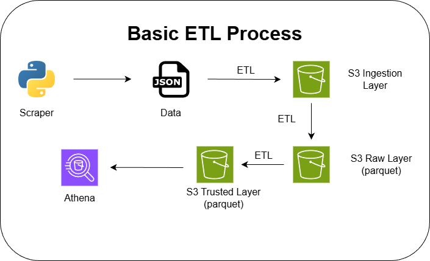

# Amazon Black Friday Scraper

This project scrapes Amazon Brazil Black Friday deals and stores the data for further analysis.

## Structure

- `run.sh` – helper script to run the scraper (and related steps) locally.
- `src/scraper/` – Scrapy project with the `amazon` spider and settings.
- `src/etl/` – ETL scripts to move and transform scraped data.
- `analytics/` – notebooks for exploratory data analysis.

## Prerequisites

- Python 3.11+
- Virtual environment with project dependencies installed (via `uv` / `pip`).

## Basic Usage

From the project root, run:

```bash
./run.sh
```

This will run the Scrapy spider and write the output JSONL files under the scraper data directory.

